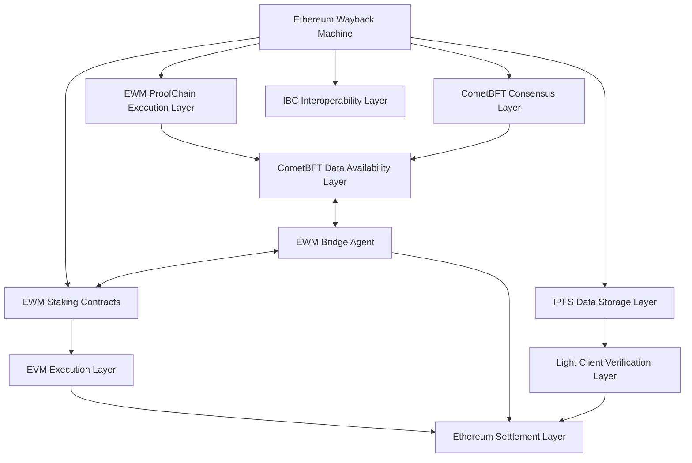
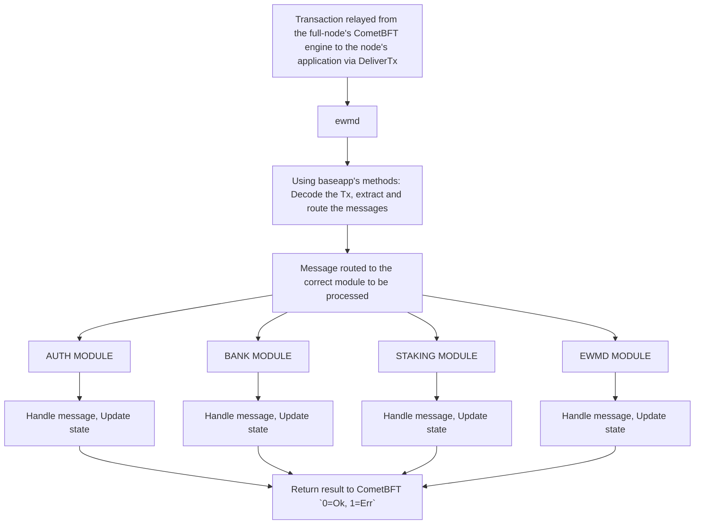

## EWM-Types: Interacting with EWM-Proofchain Node



This repo provides the golang types for interacting with modular EWM-ProofChain (fully equipped for future independent PoS operation) blockchain node. It is currently a straightforward "proof state-machine replication" engine built to scale CXT validator - EWM data object metadata "proof" submissions, using a CometBFT (previously Tendermint Byzantine Fault Tolerant) consensus layer for node replication and peer-to-peer communication.

At a very high level, the choice to pick Cosmos was due to its ability to provide full flexibility in defining the state machine replication execution layer of ProofChain. Additionally, it allows for modularity and extensibility using Golang and Protocol Buffers. In simpler terms, it can also be described as an application-specific blockchain.

## Table of Contents

1. [Introduction](#1-introduction)
2. [Core Types](#2-core-types)
3. [Message Types](#3-message-types)
4. [Query Types](#4-query-types)
5. [Genesis State](#5-genesis-state)
6. [Diagrams](#6-diagrams)
7. [Usage Examples](#7-usage-examples)

## 1. Introduction

Decentralized applications built with smart contracts are inherently capped in performance by the underlying environment. For a DApp to optimize its performance, it should be built as an application-specific blockchain. This approach allows for the choice of a novel consensus engine such as CometBFT. Additionally, an application-specific blockchain does not compete with others for computation and storage. This contrasts with non-sharded virtual machine blockchains where smart contracts compete for block space, i.e., computation and storage. The virtual machine is the biggest throughput bottleneck in the state-machine replication process, significantly increasing the computational complexity of processing data.



Hence the EWM (Ethereum Wayback Machine) Proofchain is a specialized blockchain designed to handle and verify proofs related to Ethereum and other blockchain networks. To interact with an ewm-proofchain node, you need to understand and utilize various types defined in the system. This document provides an overview of these types and their usage.


## 2. Core Types

### 2.1 LiveProofSession

The LiveProofSession represents an active proof session in the system.

```go
type LiveProofSession struct {
	Index           string `protobuf:"bytes,1,opt,name=index,proto3" json:"index,omitempty"`
	ChainId         int32  `protobuf:"varint,2,opt,name=chainId,proto3" json:"chainId,omitempty"`
	ProofType       string `protobuf:"bytes,3,opt,name=proofType,proto3" json:"proofType,omitempty"`
	BlockHeight     uint64 `protobuf:"varint,4,opt,name=blockHeight,proto3" json:"blockHeight,omitempty"`
	BlockHash       string `protobuf:"bytes,5,opt,name=blockHash,proto3" json:"blockHash,omitempty"`
	ProofHash       string `protobuf:"bytes,6,opt,name=proofHash,proto3" json:"proofHash,omitempty"`
	StoreAddress    string `protobuf:"bytes,7,opt,name=storeAddress,proto3" json:"storeAddress,omitempty"`
	ProofCount      int32  `protobuf:"varint,8,opt,name=proofCount,proto3" json:"proofCount,omitempty"`
	SessionMembers  string `protobuf:"bytes,9,opt,name=sessionMembers,proto3" json:"sessionMembers,omitempty"`
	SessionDeadline string `protobuf:"bytes,10,opt,name=sessionDeadline,proto3" json:"sessionDeadline,omitempty"`
	Finalized       bool   `protobuf:"varint,11,opt,name=finalized,proto3" json:"finalized,omitempty"`
	Expired         bool   `protobuf:"varint,12,opt,name=expired,proto3" json:"expired,omitempty"`
	Creator         string `protobuf:"bytes,13,opt,name=creator,proto3" json:"creator,omitempty"`
	BeforeIndex     string `protobuf:"bytes,14,opt,name=beforeIndex,proto3" json:"beforeIndex,omitempty"`
	AfterIndex      string `protobuf:"bytes,15,opt,name=afterIndex,proto3" json:"afterIndex,omitempty"`
}
```

Key fields:

- `Index`: Unique identifier for the session
- `ChainId`: ID of the chain the proof is for
- `ProofType`: Type of proof being processed
- `BlockHeight`: Height of the block being proved
- `ProofHash`: Hash of the proof
- `SessionMembers`: Participants in the proof session
- `Finalized`: Whether the session is finalized
- `Expired`: Whether the session has expired

### 2.2 StoredProofSession

The StoredProofSession represents a completed and archived proof session.

```go
type StoredProofSession struct {
	Index             string `protobuf:"bytes,1,opt,name=index,proto3" json:"index,omitempty"`
	ChainId           int32  `protobuf:"varint,2,opt,name=chainId,proto3" json:"chainId,omitempty"`
	ProofType         string `protobuf:"bytes,3,opt,name=proofType,proto3" json:"proofType,omitempty"`
	BlockHeight       uint64 `protobuf:"varint,4,opt,name=blockHeight,proto3" json:"blockHeight,omitempty"`
	BlockHash         string `protobuf:"bytes,5,opt,name=blockHash,proto3" json:"blockHash,omitempty"`
	ProofHash         string `protobuf:"bytes,6,opt,name=proofHash,proto3" json:"proofHash,omitempty"`
	StoreAddress      string `protobuf:"bytes,7,opt,name=storeAddress,proto3" json:"storeAddress,omitempty"`
	ProofCount        int32  `protobuf:"varint,8,opt,name=proofCount,proto3" json:"proofCount,omitempty"`
	SessionMembers    string `protobuf:"bytes,9,opt,name=sessionMembers,proto3" json:"sessionMembers,omitempty"`
	ArchivedTimestamp string `protobuf:"bytes,10,opt,name=archivedTimestamp,proto3" json:"archivedTimestamp,omitempty"`
	Finalized         bool   `protobuf:"varint,11,opt,name=finalized,proto3" json:"finalized,omitempty"`
	Creator           string `protobuf:"bytes,12,opt,name=creator,proto3" json:"creator,omitempty"`
}
```

Key fields are similar to LiveProofSession, with the addition of:

- `ArchivedTimestamp`: When the session was archived

### 2.3 StoredChainRole

StoredChainRole defines the roles assigned to various participants for a specific chain and proof type.

```go
type StoredChainRole struct {
	Index           string            `protobuf:"bytes,1,opt,name=index,proto3" json:"index,omitempty"`
	ChainId         int32             `protobuf:"varint,2,opt,name=chainId,proto3" json:"chainId,omitempty"`
	ProofSequencer  string            `protobuf:"bytes,3,opt,name=proofSequencer,proto3" json:"proofSequencer,omitempty"`
	ProofOperator   string            `protobuf:"bytes,4,opt,name=proofOperator,proto3" json:"proofOperator,omitempty"`
	ProofValidator  string            `protobuf:"bytes,5,opt,name=proofValidator,proto3" json:"proofValidator,omitempty"`
	ProofType       string            `protobuf:"bytes,6,opt,name=proofType,proto3" json:"proofType,omitempty"`
	Creator         string            `protobuf:"bytes,7,opt,name=creator,proto3" json:"creator,omitempty"`
	ValidatorStatus map[string]bool   `protobuf:"bytes,8,rep,name=validatorStatus,proto3" json:"validatorStatus,omitempty" protobuf_key:"bytes,1,opt,name=key,proto3" protobuf_val:"varint,2,opt,name=value,proto3"`
	OpValPair       map[string]string `protobuf:"bytes,9,rep,name=opValPair,proto3" json:"opValPair,omitempty" protobuf_key:"bytes,1,opt,name=key,proto3" protobuf_val:"bytes,2,opt,name=value,proto3"`
	Timestamp       string            `protobuf:"bytes,10,opt,name=timestamp,proto3" json:"timestamp,omitempty"`
}
```

Key fields:

- `ChainId`: ID of the chain
- `ProofSequencer`, `ProofOperator`, `ProofValidator`: Addresses of role assignees
- `ValidatorStatus`: Map of validator statuses
- `OpValPair`: Map of operator-validator pairs

### 2.4 StoredChainConfig

StoredChainConfig holds the configuration for a specific chain and proof type.

```go
type StoredChainConfig struct {
	Index             string `protobuf:"bytes,1,opt,name=index,proto3" json:"index,omitempty"`
	ChainId           int32  `protobuf:"varint,2,opt,name=chainId,proto3" json:"chainId,omitempty"`
	ProofType         string `protobuf:"bytes,3,opt,name=proofType,proto3" json:"proofType,omitempty"`
	SrcBlockTimeSec   string `protobuf:"bytes,4,opt,name=srcBlockTimeSec,proto3" json:"srcBlockTimeSec,omitempty"`
	SnkBlockTimeSec   string `protobuf:"bytes,5,opt,name=snkBlockTimeSec,proto3" json:"snkBlockTimeSec,omitempty"`
	QuorumReq         int32  `protobuf:"varint,6,opt,name=quorumReq,proto3" json:"quorumReq,omitempty"`
	RewardAlloc       string `protobuf:"bytes,7,opt,name=rewardAlloc,proto3" json:"rewardAlloc,omitempty"`
	MinStakeReq       string `protobuf:"bytes,8,opt,name=minStakeReq,proto3" json:"minStakeReq,omitempty"`
	MinSubmissionsReq int32  `protobuf:"varint,9,opt,name=minSubmissionsReq,proto3" json:"minSubmissionsReq,omitempty"`
	SessionTimeSec    string `protobuf:"bytes,10,opt,name=sessionTimeSec,proto3" json:"sessionTimeSec,omitempty"`
	Creator           string `protobuf:"bytes,11,opt,name=creator,proto3" json:"creator,omitempty"`
	LiveMode          bool   `protobuf:"varint,12,opt,name=liveMode,proto3" json:"liveMode,omitempty"`
	SyncBlockLimit    uint64 `protobuf:"varint,13,opt,name=syncBlockLimit,proto3" json:"syncBlockLimit,omitempty"`
	Timestamp         string `protobuf:"bytes,14,opt,name=timestamp,proto3" json:"timestamp,omitempty"`
	SyncLagLimit      uint64 `protobuf:"varint,15,opt,name=syncLagLimit,proto3" json:"syncLagLimit,omitempty"`
	SyncBlockStart    uint64 `protobuf:"varint,16,opt,name=syncBlockStart,proto3" json:"syncBlockStart,omitempty"`
	BridgeTxDayFreq   int32  `protobuf:"varint,17,opt,name=bridgeTxDayFreq,proto3" json:"bridgeTxDayFreq,omitempty"`
}
```


Key fields include various configuration parameters like quorum requirements, reward allocations, and sync settings.

## 3. Message Types

Messages are used to interact with the ewm-proofchain node. Here are some key message types:

### 3.1 MsgCreateProof

Used to submit a new proof to the system.


```go
type MsgCreateProof struct {
	Creator      string `protobuf:"bytes,1,opt,name=creator,proto3" json:"creator,omitempty"`
	ChainId      int32  `protobuf:"varint,2,opt,name=chainId,proto3" json:"chainId,omitempty"`
	ProofType    string `protobuf:"bytes,3,opt,name=proofType,proto3" json:"proofType,omitempty"`
	BlockHeight  uint64 `protobuf:"varint,4,opt,name=blockHeight,proto3" json:"blockHeight,omitempty"`
	BlockHash    string `protobuf:"bytes,5,opt,name=blockHash,proto3" json:"blockHash,omitempty"`
	ProofHash    string `protobuf:"bytes,6,opt,name=proofHash,proto3" json:"proofHash,omitempty"`
	StoreAddress string `protobuf:"bytes,7,opt,name=storeAddress,proto3" json:"storeAddress,omitempty"`
}
```


### 3.2 MsgAssignProofOperator/Validator/Sequecer

Assigns a proof operator to a specific chain and proof type.


```go
type MsgAssignProofOperator struct {
	Creator         string `protobuf:"bytes,1,opt,name=creator,proto3" json:"creator,omitempty"`
	ChainId         int32  `protobuf:"varint,2,opt,name=chainId,proto3" json:"chainId,omitempty"`
	OperatorAddress string `protobuf:"bytes,3,opt,name=operatorAddress,proto3" json:"operatorAddress,omitempty"`
	ProofType       string `protobuf:"bytes,4,opt,name=proofType,proto3" json:"proofType,omitempty"`
}
```

Similar messages exist for assigning sequencers and validators.

### 3.3 MsgUpdateChainProofConfig

Updates the configuration for a specific chain and proof type.


```go
type MsgUpdateChainProofConfig struct {
	Creator           string `protobuf:"bytes,1,opt,name=creator,proto3" json:"creator,omitempty"`
	ChainId           int32  `protobuf:"varint,2,opt,name=chainId,proto3" json:"chainId,omitempty"`
	ProofType         string `protobuf:"bytes,3,opt,name=proofType,proto3" json:"proofType,omitempty"`
	QuorumReq         int32  `protobuf:"varint,4,opt,name=quorumReq,proto3" json:"quorumReq,omitempty"`
	RewardAlloc       string `protobuf:"bytes,5,opt,name=rewardAlloc,proto3" json:"rewardAlloc,omitempty"`
	MinStakeReq       string `protobuf:"bytes,6,opt,name=minStakeReq,proto3" json:"minStakeReq,omitempty"`
	MinSubmissionsReq int32  `protobuf:"varint,7,opt,name=minSubmissionsReq,proto3" json:"minSubmissionsReq,omitempty"`
	SessionTimeSec    string `protobuf:"bytes,8,opt,name=sessionTimeSec,proto3" json:"sessionTimeSec,omitempty"`
	LiveMode          bool   `protobuf:"varint,9,opt,name=liveMode,proto3" json:"liveMode,omitempty"`
}
```


## 4. Query Types

Queries are used to retrieve information from the ewm-proofchain node. Some important query types include:

### 4.1 QueryGetLiveProofSessionRequest

Retrieves information about a specific live proof session.


```go
	rpc LiveProofSession(QueryGetLiveProofSessionRequest) returns (QueryGetLiveProofSessionResponse) {
		option (google.api.http).get = "/covalenthq/ewm/ewm/live_proof_session/{index}";
	}
```


### 4.2 QueryAllStoredChainConfigRequest

Retrieves all stored chain configurations.


```go
message QueryAllStoredChainConfigRequest {
	cosmos.base.query.v1beta1.PageRequest pagination = 1;
}
```


## 5. Genesis State

The GenesisState defines the initial state of the ewm module.


```go
type GenesisState struct {
	Params                 Params               `protobuf:"bytes,1,opt,name=params,proto3" json:"params"`
	SystemInfo             SystemInfo           `protobuf:"bytes,2,opt,name=systemInfo,proto3" json:"systemInfo"`
	LiveProofSessionList   []LiveProofSession   `protobuf:"bytes,3,rep,name=liveProofSessionList,proto3" json:"liveProofSessionList"`
	StoredChainRoleList    []StoredChainRole    `protobuf:"bytes,4,rep,name=storedChainRoleList,proto3" json:"storedChainRoleList"`
	StoredChainConfigList  []StoredChainConfig  `protobuf:"bytes,5,rep,name=storedChainConfigList,proto3" json:"storedChainConfigList"`
	StoredProofSessionList []StoredProofSession `protobuf:"bytes,6,rep,name=storedProofSessionList,proto3" json:"storedProofSessionList"`
}
```

It includes initial parameters, system info, and lists of live proof sessions, stored chain roles, configs, and proof sessions.

## 6. Diagrams

Here are some suggested diagrams to include:

1. **EWM-Proofchain Architecture**

```
   +-------------------+
   |   EWM-Proofchain  |
   |      Node         |
   +-------------------+
           |
   +-------v-------+
   |   Core Types  |
   +---------------+
   | LiveProofSession |
   | StoredProofSession|
   | StoredChainRole   |
   | StoredChainConfig |
   +---------------+
           |
   +-------v-------+
   | Interactions  |
   +---------------+
   | Messages (Tx) |
   | Queries       |
   +---------------+
```

2. **Proof Session Lifecycle**

```
   +------------+     +-----------------+     +------------------+
   | CreateProof| --> | LiveProofSession| --> | StoredProofSession|
   +------------+     +-----------------+     +------------------+
                             |
                      +------v------+
                      | Validation  |
                      +-------------+
```

3. **Chain Role Assignment**

```
   +------------------+     +-------------------+
   | AssignProofOperator|     |                   |
   | AssignProofValidator| --> | StoredChainRole   |
   | AssignProofSequencer|     |                   |
   +------------------+     +-------------------+
```

## 7. Usage Examples

Here are some examples of how to use these types:

1. Creating a new proof:

```go
proof := types.NewMsgCreateProof(
    creator,
    chainId,
    proofType,
    blockHeight,
    blockHash,
    proofHash,
    storeAddress,
)
```

2. Querying a live proof session:

```go
request := &types.QueryGetLiveProofSessionRequest{
    Index: sessionIndex,
}
response, err := queryClient.LiveProofSession(context.Background(), request)
```

3. Updating chain proof config:

```go
msg := types.NewMsgUpdateChainProofConfig(
    creator,
    chainId,
    proofType,
    quorumReq,
    rewardAlloc,
    minStakeReq,
    minSubmissionsReq,
    sessionTimeSec,
    liveMode,
)
```

These examples demonstrate how to construct messages and queries using the defined types to interact with the ewm-proofchain node.

Remember to include proper error handling and context in your actual implementation.
